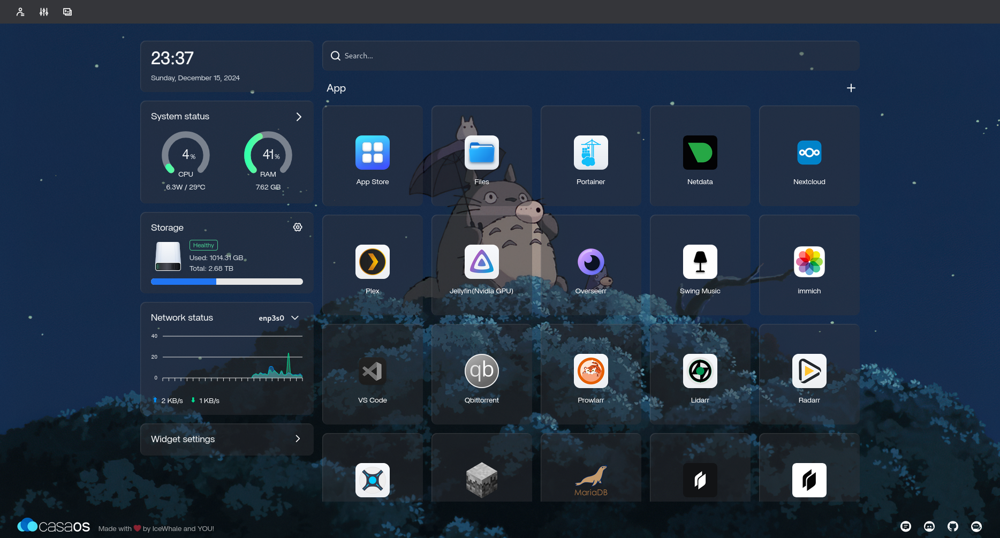

## Overview:

Project Status: ALPHA 1.0
This Repository Homelab contains all my homelab documentation files. Here you'll find notes, setups, and configurations for infrastructure, applications, networking, and more.
This project is still in the experimental stage, and I don't use anything critical on it. Expect breaking changes that may require a complete redeployment.
The homelab runs on an older system currently running Ubuntu 24.04.1 LTS x86_64.

## Hardware:

CPU: Intel i7-4790 (8) @ 4.000GHz

GPU 1: NVIDIA GeForce GT 730

GPU 2: Intel HD Graphics

Memory: 7804MiB

## Hosted Services:

### _Casa OS_ 

CasaOS is a lightweight, open sourced server dashboard designed for creating a personal cloud or managing home servers.
Casa OS helps me gives access to all my services with a GUI interface running inside the server in an aesthetic manner. It comes with an in-built file and disk manager. It also comes with its own appstore which allows installing services directly into the server through the web interface of the dashboard.
It provides real-time metrics like CPU and memory usage, network speeds and disk health.

[Official Github Repo](https://github.com/IceWhaleTech/CasaOS)

### _Portainer_ 

Portainer is a lightweight service delivery platform for containerized applications that I use to manage my Docker environments. It is designed to be as simple to deploy as it is to use. It allows me to manage all my orchestrator resources (containers, images, volumes, networks and more) through a ‘smart’ GUI and/or an extensive API.
It is currently running :

[Official Github Repo](https://github.com/portainer/portainer)

[Docker Compose File](Services/portainer/compose.yaml)

### _NetData_ 

Netdata is a high-performance, cloud-native, and on-premises observability platform designed to monitor metrics and logs with unparalleled efficiency. It delivers a simpler, faster, and significantly easier approach to real-time, low-latency monitoring for systems, containers, and applications.
It allows me to moniter CPU, GPU, memory, network, hardware, processes, O/S services, containers/VMs, synthetic checks, etc. with graphs and charts in real-time.

[Official Github Repo](https://github.com/netdata/netdata)

[Docker Compose File](Services/netdata/compose.yaml)

### _Plex Media Server_ 

Plex is a popular media server platform that allows me to organize, stream, and access my personal media (like movies, TV shows, music, and photos) across multiple devices. It acts as a centralized server where I can store my media and then stream it to various devices such as smart TVs, smartphones, tablets, and computers. It also supports remote access, enabling me to stream their content from anywhere.

But there's more to plex media server than you'd think.

[Official Github Repo](https://github.com/plexinc)

[Docker Compose File](Services/plex/compose.yaml)

### _JellyFin_ 

Jellyfin is a Free Software Media System that puts you in control of managing and streaming your media. It is an alternative to the proprietary Emby and Plex, to provide media from a dedicated server to end-user devices via multiple apps. It's an alternative/backup service to plex.

[Official Github Repo](https://github.com/jellyfin/jellyfin)

[Docker Compose File](Services/jellyfin/compose.yaml)

### _Overseerr Media Request Service_ 

Overseerr allows users to request media like movies and TV shows in the quality they desire and send the request to the server administrator which can further approve/disapprove the requested media.

[Official Github Repo](https://github.com/sct/overseerr)

[Docker Compose File](Services/overseerr/compose.yaml)

### _Radarr_ 

If the admin approves the movie requested by the user, Radarr fetches metadata for the requested movie and creates a folder insidde the server. It provides utilities like movie reviews, crtique rating, cast information, etc. for the user.
Radarr also automates the process of helping plex access the downloaded movie. It directs plex to access only the movie from the download folder and nothing else, so that plex doesnt interfere with media other than movies.

[Official Github Repo](https://github.com/Radarr/Radarr)

[Docker Compose File](Services/radarr/compose.yaml)

### _Sonarr_ 

Sonarr is similar to Radarr except it is designed to process TV shows and web series as they have to be treated differently than movies with each show having multiple episodes and seasons and hence need to be in a collection so that plex doesn't classify each episode as its own movie.

[Official Github Repo](https://github.com/Sonarr/Sonarr)

[Docker Compose File](Services/sonarr/compose.yaml)

### _Lidarr_ 

Lidarr handles all the audio/music files and basically is my own Music Manager.
It does a similar job to Radarr/Sonarr in creating and managing all the music files in the music folder and helps Plex/Swing Music(Music Player) fetch and play it. It can help choose the desired audio quality which we desire to listen to, basically you can fetch studio quality music files through Lidarr using Prowlarr.

[Official Github Repo](https://github.com/Lidarr/Lidarr)

[Docker Compose File](Services/lidarr/compose.yaml)

### _Prowlarr_ 

Prowlarr is an indexer manager/proxy built on the popular *arr .net/reactjs base stack to integrate with Radarr/Lidarr/Sonarr supporting management of both Torrent Trackers and Usenet Indexers. (Indexers serve as search engines that crawl torrent or Usenet files and index them, providing users with links to the content.)

[Official Github Repo](https://github.com/Prowlarr/Prowlarr)

[Docker Compose File](Services/prowlarr/compose.yaml)

### _Qbittorrent_ 

qBittorrent is an open-source BitTorrent client that I use for downloading and sharing files via the BitTorrent protocol. It provides a user-friendly interface and a variety of features that make it a versatile tool for managing torrents.

[Official Github Repo](https://github.com/qbittorrent/qBittorrent)

[Docker Compose File](Services/qbittorrent/compose.yaml)

### _Deluge_ 

Deluge is a BitTorrent client that utilizes a daemon/client model. It has various user interfaces available such as the GTK-UI, Web-UI and Console-UI. It uses libtorrent at its core to handle the BitTorrent protocol.

[Official Github Repo](https://github.com/deluge-torrent/deluge)

[Docker Compose File](Services/deluge/compose.yaml)

### _Jdownloader_ 

JDownloader is a free, open-source download management tool with a huge community that makes downloading as easy and fast as it should be.

[Official Github Repo](https://github.com/johna23-lab/jdownloader2)

[Docker Compose File](Services/jdownloader/compose.yaml)

### _Immich_ 

Immich is a high performance self-hosted photo and video management solution. It's a nice alternantive to google photos but self hosted at HomeLab server, which provides additional privacy and security to your personal media.

[Official Github Repo](https://github.com/immich-app/immich)

[Docker Compose File](Services/immich/compose.yaml)

### _MariaDB_ 

MariaDB server is a community developed fork of MySQL server. Started by core members of the original MySQL team, MariaDB actively works with outside developers to deliver the most featureful, stable, and sanely licensed open SQL server in the industry.

[Official Github Repo](https://github.com/MariaDB/mariadb-docker)

[Docker Compose File](Services/mariadb/compose.yaml)

### _NextCloud_ 

Nextcloud Hub is the industry-leading, fully open-source, on premise content collaboration platform. Teams access, share and edit their documents, chat and participate in video calls and manage their mail and calendar and projects across mobile, desktop and web interfaces.

[Official Github Repo](https://github.com/nextcloud/all-in-one)

[Docker Compose File](Services/nextcloud/compose.yaml)

### _n8n_ 

n8n is a workflow automation platform that gives technical teams the flexibility of code with the speed of no-code.

[Official Github Repo](https://github.com/n8n-io/n8n)

[Docker Compose File](Services/n8n/compose.yaml)

### _MineCraft_ 

A Minecraft server is a player-owned or business-owned multiplayer game server for the 2009 Mojang Studios video game Minecraft. In this context, the term "server" often colloquially refers to a network of connected servers, rather than a single machine. Players can start their own server either by setting one up on a computer using software provided by Mojang, or by using a hosting provider so they can have their server run on dedicated machines with guaranteed uptime.

[Official Github Repo](https://github.com/topics/minecraft-server)

[Docker Compose File](Services/minecraft/compose.yaml)

[My friend](https://github.com/ohhitsaryan) asked me to host a Minecraft server on my HomeLab so I used this service to host one.

### _VScodium_ 

VSCodium is a community-driven, freely-licensed binary distribution of Microsoft’s editor VS Code.
This VScodium docker edition allows me to edit codes through my server using a web browser.

[Official Github Repo](https://github.com/VSCodium/vscodium)

[Docker Compose File](Services/vscodium/compose.yaml)

### _twingate-connector_ 

Twingate is a zero trust network access (ZTNA) platform designed to improve the security and manageability of remote access to internal applications, resources, and networks. It replaces traditional VPNs with a more secure, scalable, and user-friendly solution.

[Official Github Repo](https://github.com/Twingate)

[Docker Compose File](Services/twingate-connector/compose.yaml)
